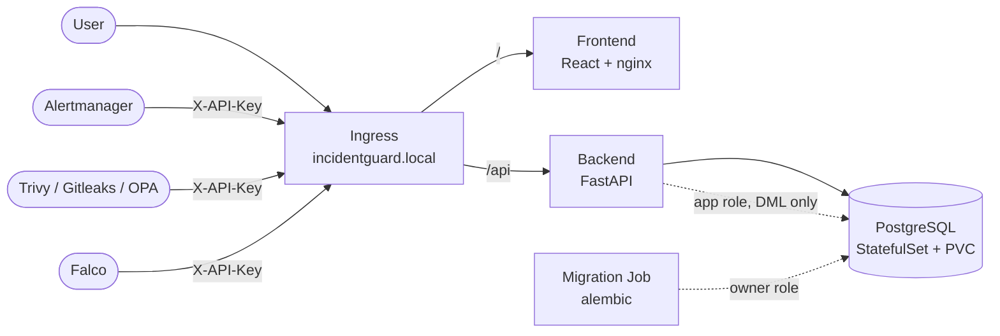

# IncidentGuard

A cloud-native incident monitoring platform, built as a vehicle for practising
**DevSecOps engineering end to end** — threat modeling, container hardening,
Kubernetes security, least-privilege access, and policy-as-code.

The application itself is intentionally small: it ingests alerts from Prometheus
Alertmanager, security scanners, and Falco, normalises them into incident records,
and exposes them through an API and dashboard. The interesting work is the
infrastructure and security engineering around it.

---

## Security engineering

The practices below are implemented and verifiable in this repository.

### Threat modeling
- **STRIDE threat model** covering 7 components — [`docs/uml/threat-model-stride.md`](docs/uml/threat-model-stride.md)
- Data-flow diagram and attack-surface map — [`docs/uml/`](docs/uml/)
- Mitigations are tracked back to the threats that motivated them

### Application security
- **Session auth via httpOnly cookies** — the JWT is never readable by JavaScript,
  eliminating token exfiltration through XSS
- **CSRF protection** using the double-submit cookie pattern, enforced on all
  state-changing endpoints
- **bcrypt** password hashing (cost factor 12)
- **Same-origin architecture** in every environment — the API is served under `/api`
  through the Ingress (k8s), an nginx proxy (compose), and the Vite dev server.
  No CORS surface exists to misconfigure.
- Security headers and a restrictive **Content-Security-Policy** (`script-src 'self'`,
  `connect-src 'self'`)
- Separate authentication paths for humans (JWT) and machines (per-source API keys)

### Container security
- **Multi-stage builds** — build toolchains never reach the runtime image
- **Non-root users** in every image
- **Base images pinned by digest**, not tag — tracked by Dependabot
- Unprivileged ports only (nginx on 8080, not 80)

### Kubernetes hardening
- **Pod SecurityContexts** on every workload: `runAsNonRoot`, `readOnlyRootFilesystem`,
  `allowPrivilegeEscalation: false`, all capabilities dropped, `seccompProfile: RuntimeDefault`
- **Default-deny NetworkPolicies** (enforced by Calico) — Postgres accepts traffic only
  from the backend, the backend and frontend only from the ingress controller
- **Dedicated ServiceAccounts** per workload with `automountServiceAccountToken: false`
  and zero RBAC bindings — no workload can reach the Kubernetes API
- **Least-privilege database role** — the application connects as a DML-only role that
  cannot alter schema; migrations run separately as the owner
- **Secrets are never committed** — generated at bootstrap by
  [`scripts/k8s-bootstrap-secrets.sh`](scripts/k8s-bootstrap-secrets.sh)
- **Migrations run as a pre-deploy Job**, not an entrypoint step, so concurrent replicas
  cannot race applying schema changes

### Policy as code
[OPA/Gatekeeper](k8s/security/opa/) admission policies enforcing the above at deploy
time — what was configured by hand becomes a control the cluster enforces:

| Policy | Enforces |
|---|---|
| `K8sBlockLatestTag` | images must be version-pinned |
| `K8sRequireNonRoot` | `runAsNonRoot` must be declared |
| `K8sRequireResourcesLimits` | memory limits required |
| `K8sRequireResourcesRequests` | CPU and memory requests required |

Policies were rolled out in `dryrun` first, audited against the running cluster,
remediated, and only then promoted to `deny`.

---

## Architecture



**Stack:** FastAPI (Python 3.12) · PostgreSQL · React 19 + TypeScript (Vite) ·
Kubernetes (minikube) · Calico · OPA/Gatekeeper · Prometheus / Grafana / Loki

---

## Repository layout

```
backend/          FastAPI service, Alembic migrations
frontend/         React + TypeScript dashboard
k8s/              Kubernetes manifests
  ├── postgres/   StatefulSet, headless Service, NetworkPolicy
  ├── backend/    Deployment, migration Job, Service, ServiceAccounts
  ├── frontend/   Deployment, Service
  ├── security/   OPA/Gatekeeper policies
  └── monitoring/ Prometheus, Grafana, Loki configuration
scripts/          Bootstrap scripts (secrets, database roles)
docs/uml/         Threat model, DFD, sequence and class diagrams
```

---

## Running it

**Kubernetes (the primary target):** see
[`docs/kubernetes-runbook.md`](docs/kubernetes-runbook.md) — a full deployment
sequence from an empty machine, which doubles as the disaster-recovery procedure.

**Docker Compose (quick local stack):**

```bash
cp .env.example .env      # fill in real values
docker compose up -d
```

Serves the app on `localhost:3000`, with Prometheus, Alertmanager, Grafana and Loki
alongside.

---


