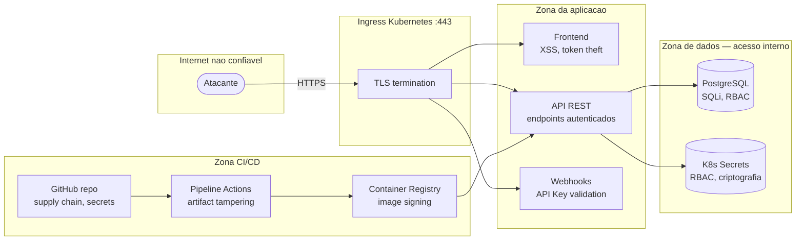

```mermaid
flowchart LR
  subgraph NET["Internet nao confiavel"]
    ATK(["Atacante"])
  end

  subgraph ING["Ingress Kubernetes :443"]
    TLS["TLS termination"]
  end

  subgraph APP["Zona da aplicacao"]
    FE["Frontend\nXSS, token theft"]
    API["API REST\nendpoints autenticados"]
    WH["Webhooks\nAPI Key validation"]
  end

  subgraph DATA["Zona de dados — acesso interno"]
    DB[("PostgreSQL\nSQLi, RBAC")]
    SEC[("K8s Secrets\nRBAC, criptografia")]
  end

  subgraph CICD["Zona CI/CD"]
    GIT["GitHub repo\nsupply chain, secrets"]
    PIPE["Pipeline Actions\nartifact tampering"]
    REG["Container Registry\nimage signing"]
  end

  ATK -->|"HTTPS"| TLS
  TLS --> FE & API & WH
  API --> DB & SEC
  GIT --> PIPE --> REG --> API
```
