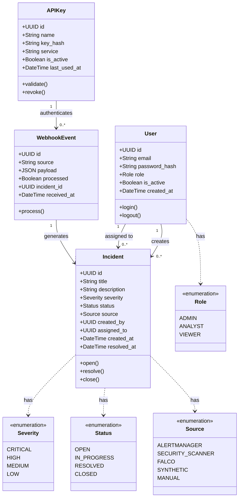

```mermaid
classDiagram
  direction TB
  class User {
    +UUID id
    +String email
    +String password_hash
    +Role role
    +Boolean is_active
    +DateTime created_at
    +login()
    +logout()
  }
  class Incident {
    +UUID id
    +String title
    +String description
    +Severity severity
    +Status status
    +Source source
    +UUID created_by
    +UUID assigned_to
    +DateTime created_at
    +DateTime resolved_at
    +open()
    +resolve()
    +close()
  }
  class APIKey {
    +UUID id
    +String name
    +String key_hash
    +String service
    +Boolean is_active
    +DateTime last_used_at
    +validate()
    +revoke()
  }
  class WebhookEvent {
    +UUID id
    +String source
    +JSON payload
    +Boolean processed
    +UUID incident_id
    +DateTime received_at
    +process()
  }
  class Role {
    <<enumeration>>
    ADMIN
    ANALYST
    VIEWER
  }
  class Severity {
    <<enumeration>>
    CRITICAL
    HIGH
    MEDIUM
    LOW
  }
  class Status {
    <<enumeration>>
    OPEN
    IN_PROGRESS
    RESOLVED
    CLOSED
  }
  class Source {
    <<enumeration>>
    ALERTMANAGER
    SECURITY_SCANNER
    FALCO
    SYNTHETIC
    MANUAL
  }
  User "1" --> "0..*" Incident : creates
  User "1" --> "0..*" Incident : assigned to
  WebhookEvent "1" --> "1" Incident : generates
  APIKey "1" --> "0..*" WebhookEvent : authenticates
  User ..> Role : has
  Incident ..> Severity : has
  Incident ..> Status : has
  Incident ..> Source : has
```
