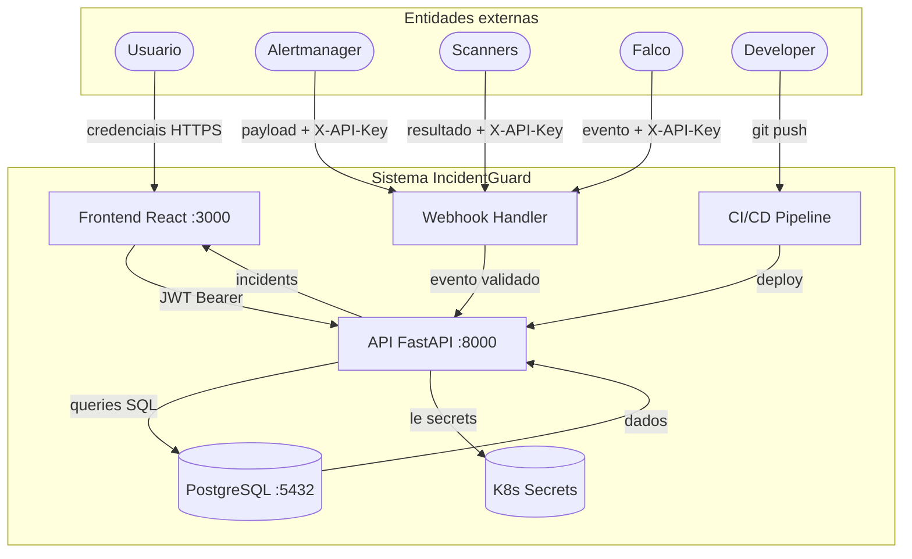

```mermaid
flowchart TD
  subgraph EXT["Entidades externas"]
    U(["Usuario"])
    ALR(["Alertmanager"])
    SCN(["Scanners"])
    FAL(["Falco"])
    DEV(["Developer"])
  end

  subgraph SYS["Sistema IncidentGuard"]
    FE["Frontend React :3000"]
    API["API FastAPI :8000"]
    WH["Webhook Handler"]
    DB[("PostgreSQL :5432")]
    SEC[("K8s Secrets")]
    PIPE["CI/CD Pipeline"]
  end

  U -->|"credenciais HTTPS"| FE
  FE -->|"JWT Bearer"| API
  API -->|"queries SQL"| DB
  DB -->|"dados"| API
  API -->|"le secrets"| SEC
  API -->|"incidents"| FE
  ALR -->|"payload + X-API-Key"| WH
  SCN -->|"resultado + X-API-Key"| WH
  FAL -->|"evento + X-API-Key"| WH
  WH -->|"evento validado"| API
  DEV -->|"git push"| PIPE
  PIPE -->|"deploy"| API
```
