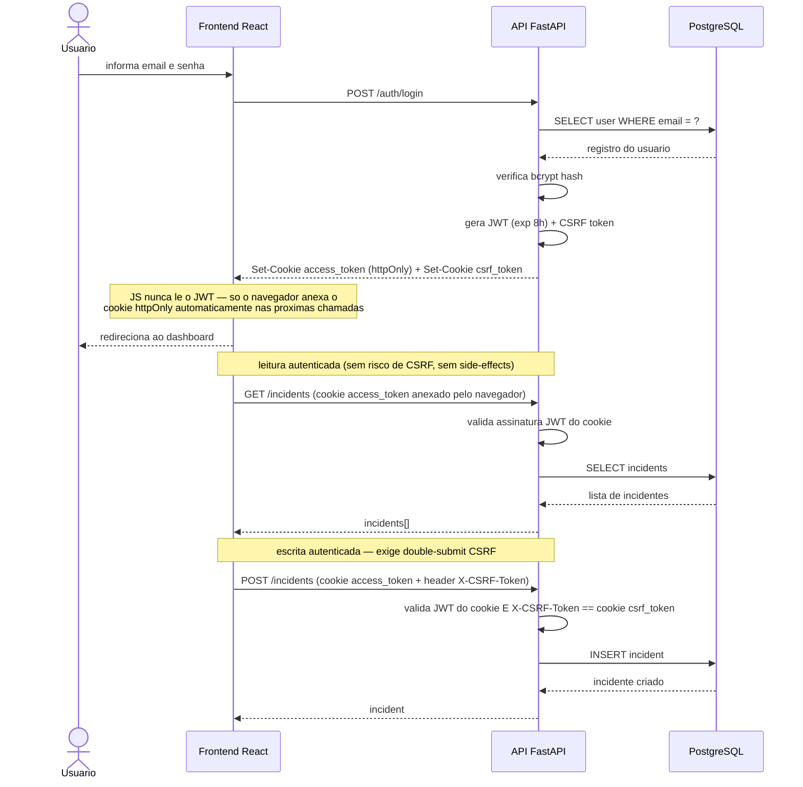

```mermaid
sequenceDiagram
  actor U as Usuario
  participant FE as Frontend React
  participant API as API FastAPI
  participant DB as PostgreSQL

  U->>FE: informa email e senha
  FE->>API: POST /auth/login
  API->>DB: SELECT user WHERE email = ?
  DB-->>API: registro do usuario
  API->>API: verifica bcrypt hash
  API->>API: gera JWT (exp 8h) + CSRF token
  API-->>FE: Set-Cookie access_token (httpOnly) + Set-Cookie csrf_token
  Note over FE: JS nunca le o JWT — so o navegador anexa o<br/>cookie httpOnly automaticamente nas proximas chamadas
  FE-->>U: redireciona ao dashboard

  Note over FE,API: leitura autenticada (sem risco de CSRF, sem side-effects)
  FE->>API: GET /incidents (cookie access_token anexado pelo navegador)
  API->>API: valida assinatura JWT do cookie
  API->>DB: SELECT incidents
  DB-->>API: lista de incidentes
  API-->>FE: incidents[]

  Note over FE,API: escrita autenticada — exige double-submit CSRF
  FE->>API: POST /incidents (cookie access_token + header X-CSRF-Token)
  API->>API: valida JWT do cookie E X-CSRF-Token == cookie csrf_token
  API->>DB: INSERT incident
  DB-->>API: incidente criado
  API-->>FE: incident
```