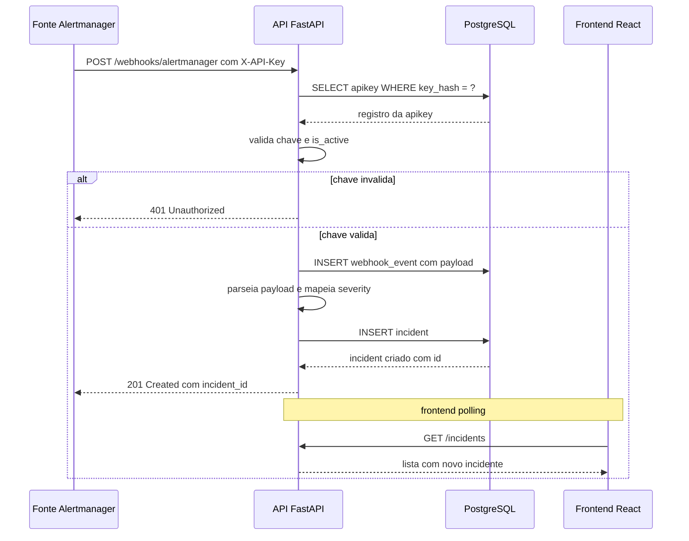

```mermaid
sequenceDiagram
  participant SRC as Fonte Alertmanager
  participant API as API FastAPI
  participant DB as PostgreSQL
  participant FE as Frontend React

  SRC->>API: POST /webhooks/alertmanager com X-API-Key
  API->>DB: SELECT apikey WHERE key_hash = ?
  DB-->>API: registro da apikey
  API->>API: valida chave e is_active

  alt chave invalida
    API-->>SRC: 401 Unauthorized
  else chave valida
    API->>DB: INSERT webhook_event com payload
    API->>API: parseia payload e mapeia severity
    API->>DB: INSERT incident
    DB-->>API: incident criado com id
    API-->>SRC: 201 Created com incident_id
    Note over API,FE: frontend polling
    FE->>API: GET /incidents
    API-->>FE: lista com novo incidente
  end
```